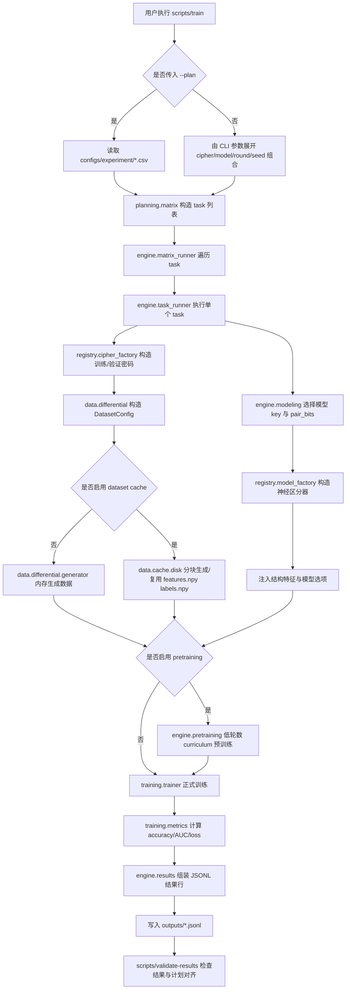

# 分组密码结构适配神经差分区分器

本项目面向毕业论文“创新一”，研究主题为：

```text
面向分组密码结构与输入组织联合适配的神经差分区分器方法
```

项目目标是构建一个可复现、可扩展、工程结构清晰的神经差分区分器实验框架。当前代码重点支持不同分组密码结构（ARX、SPN、Feistel-like）、不同输入组织方式（单对、多对、MCND、结构特征）、不同模型族之间的训练、评估和结果对齐。

本仓库按深度学习项目的常见工程方式组织：

- `configs/` 保存实验矩阵和远程运行配置。
- `src/blockcipher_nd/` 保存所有可复用源码、训练引擎和研究任务实现。
- `scripts/` 只保留很薄的命令入口，不承载核心逻辑。
- `outputs/`、`runs/` 等目录用于生成结果，已在 `.gitignore` 中忽略。

仓库根目录刻意不保留 `experiments/` 源码目录。实验应该由“配置 + CLI + 输出产物”表达，核心实现应放在 `src/blockcipher_nd/` 中，避免实验脚本越长越乱。

## 快速开始

安装依赖：

```bash
uv sync
```

运行测试：

```bash
uv run pytest -q
```

检查本机 PyTorch GPU 可见性：

```bash
uv run python -c "import torch; print(torch.cuda.is_available()); print(torch.cuda.device_count())"
```

查看主训练入口：

```bash
uv run python scripts/train --help
```

## 项目结构

```text
configs/
  experiment/innovation1/       创新一实验矩阵、筛选配置和复现实验配置
  remote/                       远程 GPU 运行规格和启动配置

src/blockcipher_nd/
  ciphers/                      分组密码实现，按 ARX、SPN、Feistel-like 分类
    arx/                        SPECK、CHAM、LEA 等 ARX 密码
    spn/                        PRESENT、GIFT、AES、ARIA 等 SPN 密码
    feistel/                    SIMON、SIMECK、DES、SM4、Camellia 等

  data/                         差分数据集配置、生成和缓存
    differential/               数据集 config、metadata、validation、row samplers、key helpers
    cache/                      磁盘缓存数据集，支持大规模生成、复用和进度记录

  features/                     密文对特征编码和结构感知特征
    encoders/                   bitwise、ARX、SPN/PRESENT、PRESENT matrix/SBox-DDT 编码器

  models/                       神经区分器模型
    baseline/                   CNN、MLP、ResNet、Transformer、DBitNet 等基线模型
    common/                     模型共享组件、激活函数、归一化、池化等
    structure/                  结构适配模型
      arx/                      ARX carry、word、trail、round-stat 结构模型
      spn/                      SPN/PRESENT pair-set、trail、matrix、Inception-MCND 模型
      feistel/                  Feistel-like 结构模型预留

  training/                     PyTorch 训练层
    types.py                    TrainingConfig、TrainingResult 等类型
    data.py                     DataLoader 和设备选择
    metrics.py                  accuracy、AUC、calibration、预测辅助函数
    optim.py                    optimizer、loss、scheduler
    trainer.py                  二分类训练主循环
    binary.py                   训练 API facade

  engine/                       实验运行引擎
    matrix_runner.py            主矩阵训练 CLI 逻辑
    task_runner.py              单个 task 的训练 pipeline 编排
    task_config.py              task 到 dataset/training config 的适配
    datasets.py                 内存数据集和磁盘缓存数据集选择
    modeling.py                 模型选择、结构特征注入、模型 metadata
    pretraining.py              可选 curriculum pretraining 阶段
    progress.py                 JSONL 进度事件
    results.py                  结果 JSONL 记录组装

  registry/                     注册表和工厂
    cipher_factory.py           密码构造与默认差分
    cipher_profiles.py          密码结构 profile
    difference_profiles.py      文献差分 profile
    model_factory.py            模型构造入口
    model_families/             baseline、pairset、ARX、SPN、MoE 模型族构造
    model_options.py            模型参数解析

  tasks/                        具体研究任务实现
    smoke.py                    本地小规模 smoke
    innovation1/                创新一相关任务
      spn_candidate/            PRESENT candidate-evidence 数据集/cache 和 baseline
      spn_candidate_evidence.py PRESENT candidate-evidence 任务入口
      spn_active_pattern.py     PRESENT active-pattern 任务
      spn_feature_audit.py      SPN 特征分离审计
      zhang_wang_checkpoint.py  Zhang/Wang checkpoint 评估

  planning/                     实验矩阵读取、任务构造和结果-计划对齐
  evaluation/                   结果摘要
  hpo/                          HPO 配置预留
  remote/                       远程执行支持预留
  cli/                          package-backed CLI 模块

scripts/
  train                         主矩阵训练入口
  smoke                         本地最小 smoke run
  spn-candidate-evidence        PRESENT candidate-evidence 路线
  spn-active-pattern            PRESENT active-pattern 路线
  audit-spn-features            SPN 特征分离审计
  validate-results              结果和计划对齐检查
  evaluate-zhang-wang-checkpoint

docs/
  experiments/                  实验记录
  research/                     文献和方法调研记录

outputs/, runs/                 生成产物目录，不作为源码提交
```

## 运行流程

主训练流程从命令行入口开始，配置矩阵会被展开成多个 task，每个 task 经过数据集构造、模型构建、可选预训练、正式训练和结果记录，最后再做结果-计划对齐。



PRESENT candidate-evidence 等专项路线也遵循相同原则：`scripts/` 只负责进入任务，核心数据集、模型和评估逻辑放在 `src/blockcipher_nd/tasks/innovation1/` 及其下游模块中。

## 常用命令

查看主训练 CLI：

```bash
uv run python scripts/train --help
```

运行一个本地最小 smoke：

```bash
uv run python scripts/smoke \
  --rounds 1 \
  --samples-per-class 16 \
  --epochs 1 \
  --batch-size 8 \
  --hidden-bits 8 \
  --output outputs/smoke_result.json
```

运行一个极小的矩阵训练任务：

```bash
uv run python scripts/train \
  --ciphers speck32 \
  --models mlp \
  --rounds 1 \
  --seeds 0 \
  --samples-per-class 8 \
  --pairs-per-sample 1 \
  --epochs 1 \
  --batch-size 4 \
  --hidden-bits 8 \
  --device cpu \
  --output outputs/example_tiny_matrix.jsonl
```

使用配置矩阵运行训练：

```bash
uv run python scripts/train \
  --plan configs/experiment/innovation1/innovation1_spn_present_active_pattern_r7_screen.csv \
  --epochs 1 \
  --batch-size 8 \
  --hidden-bits 8 \
  --device cpu \
  --output outputs/example_matrix.jsonl
```

运行带 curriculum pretraining 的极小任务：

```bash
uv run python scripts/train \
  --ciphers speck32 \
  --models mlp \
  --rounds 2 \
  --seeds 0 \
  --samples-per-class 8 \
  --epochs 1 \
  --batch-size 4 \
  --hidden-bits 8 \
  --device cpu \
  --pretrain-rounds 1 \
  --pretrain-epochs 1 \
  --output outputs/example_pretrain_matrix.jsonl
```

运行 PRESENT candidate-evidence 路线，并启用磁盘特征缓存：

```bash
uv run python scripts/spn-candidate-evidence \
  --output outputs/spn_candidate_evidence_smoke.jsonl \
  --rounds 7 \
  --seed 0 \
  --samples-per-class 8 \
  --pairs-per-sample 2 \
  --feature-cache-root outputs/feature_cache/spn_candidate_evidence_smoke \
  --feature-cache-chunk-size 2 \
  --progress-output outputs/spn_candidate_evidence_smoke_progress.jsonl \
  --epochs 1 \
  --device cpu
```

检查结果是否和计划矩阵对齐：

```bash
uv run python scripts/validate-results \
  --plan configs/experiment/innovation1/innovation1_spn_present_active_pattern_r7_screen.csv \
  --results outputs/example_matrix.jsonl \
  --output outputs/example_matrix_alignment.json
```

## 训练数据和缓存

普通小规模训练可以直接使用内存数据集。中等规模或远程训练应使用磁盘缓存，避免一次性在内存中生成全部样本。

主训练入口通过以下参数启用数据集缓存：

```bash
--dataset-cache-root outputs/dataset_cache/example
--dataset-cache-chunk-size 8192
--progress-output outputs/example_progress.jsonl
```

缓存数据会写入：

```text
features.npy
labels.npy
metadata.json
```

缓存复用依赖完整 metadata 匹配，包括 cipher、rounds、seed、input_difference、feature_encoding、negative_mode、sample_structure、key_rotation_interval、selected_bit_indices 等关键字段。

## 结果文件

训练结果一般写为 JSONL，每一行对应一个 task。常见字段包括：

- `cipher`、`cipher_key`、`structure`
- `model`、`selected_model`、`architecture`
- `rounds`、`seed`、`input_difference`
- `samples_per_class`、`pairs_per_sample`
- `feature_encoding`、`negative_mode`
- `metrics`
- `history`
- `training`
- `validation`

对于配置矩阵实验，建议训练完成后使用 `scripts/validate-results` 做结果-计划对齐检查。

## 证据口径

本项目涉及论文实验和远程训练，汇报时必须区分不同证据等级。

- 不要把 SPN/PRESENT 的 `8k`、`16k`、`32k`、`65k` samples-per-class 运行称为 formal training 或最终失败结论；这些只能算 smoke、screen 或中等诊断。
- 对 SPN/PRESENT，必须区分 total rows 和 `samples_per_class`。例如 `131072` total rows 通常只是 `65536/class`。
- 对 SPN/PRESENT 的可靠尺度判断，至少需要 `65536/class -> 262144/class` 阶梯；正式结论应使用至少 `1000000/class` 和多 seed。
- ARX/SPECK 与 SPN/PRESENT 的证据等级不能混用。ARX/SPECK 已有 `>=100000/class` 结果，不代表 SPN/PRESENT 也达到同等证据规模。
- 严格负样本应使用 encrypted random plaintexts。random ciphertext negatives 只能作为 ablation/control。
- PRESENT-80 r7 的严格参考是 Zhang/Wang 2022 Case2 `m=16`，accuracy `0.7205`。如果本地没有复现，必须明确说明。
- multi-query aggregation 是应用层证据，不等价于 raw single-sample SOTA。
- fallback-retrieved 原始文件、不完整 archive、缺失 summary、临时路线决策都不能直接作为论文式结论。

## 开发规范

- 使用 `uv run pytest ...`，不要直接使用裸 `pytest`。
- 新的可复用实现放在 `src/blockcipher_nd/`。
- 新实验定义放在 `configs/`，不要新增根目录 `experiments/` 源码树。
- `scripts/` 只写薄入口，核心逻辑应放在 `src/blockcipher_nd/cli/`、`engine/` 或 `tasks/`。
- 生成结果、缓存、checkpoint、日志放在 `outputs/`、`runs/` 或远程指定产物目录，不提交到源码。
- 大规模远程训练必须具备磁盘缓存、metadata、进度 JSONL 和参数匹配复用能力。
- 改完结构或训练逻辑后，至少运行：

```bash
uv run pytest -q
uv run python scripts/train --help
uv run python scripts/spn-candidate-evidence --help
```

## 当前结构原则

当前项目的核心约束是：训练实验不应该反向污染工程结构。

- `configs/` 是“要跑什么”。
- `scripts/` 是“怎么从命令行进入”。
- `engine/` 是“如何编排训练”。
- `data/` 是“如何构造样本和缓存”。
- `features/` 是“如何把密码观测编码成模型输入”。
- `models/` 是“神经区分器结构”。
- `training/` 是“通用 PyTorch 训练机制”。
- `tasks/` 是“具体研究路线的任务实现”。

这样后续继续加 SPN/PRESENT 路线、ARX 对照、Feistel-like 模型或远程 scale run 时，不需要把逻辑塞回脚本里。
