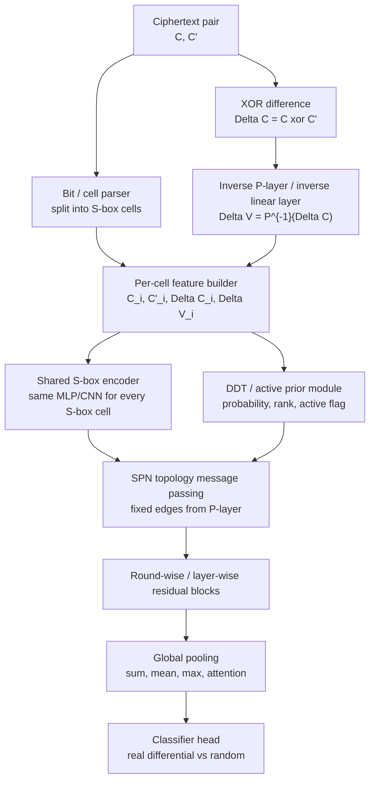

# 基于综述的 SPN 专用神经差分区分器研究任务整理

本文依据 `Survey: Six Years of Neural Differential Cryptanalysis` 更新版 PDF，以及此前整理的近三年 SPN/Feistel/ARX 文献汇总，整理一个面向后续实验和论文写作的任务定位。重点不是复述综述全文，而是回答：如果要做真正面向 SPN 结构的神经网络差分区分器，应该把问题放在哪里，怎样设计输入、网络和实验，怎样避免被认为只是“换模型堆复杂度”。

## 1. 综述给出的总体判断

这份综述系统梳理了 Gohr 2019 之后六年的神经差分密码分析工作。作者统计到截至 2025 年 2 月，Gohr 论文在 Google Scholar 上有 238 篇引用，其中聚焦 neural differential cryptanalysis 的 peer-reviewed 文献为 71 篇。综述的核心结论对本课题很重要：

1. 领域已经从单纯训练 neural distinguisher，扩展到 explainability、neural-aided key recovery、feature engineering、多 pair、多差分、相关密钥等方向。
2. 当前最大问题之一是结果不可比。不同论文在输入格式、样本数、训练流程、测试集大小、是否多 pair、是否 related-key、是否 advanced feature engineering 上差异很大。
3. 不能只用“轮数更高”作为贡献。很多高轮数结果依赖多 pair、特殊 setting、相关密钥、很小优势或统计证据不足，必须按统一 taxonomy 说明。
4. 复杂网络不一定更强。综述认为进展更多来自“学习设置与目标密码统计结构匹配”，而不是简单加深模型或增加参数。
5. Feature engineering 有价值，但必须严格控制变量。否则提升可能来自更多明密文对、不同训练设置、不同任务难度，而不是特征本身。

因此，你的任务如果要写得扎实，应该定位为：

> 面向 SPN 结构的结构归纳偏置神经差分区分器：把 S-box cell、P-layer 扩散关系、逆置换差分、局部 DDT/active 信息显式组织进输入和网络结构，并通过统一 taxonomy、强 baseline 和消融实验验证这种结构先验是否真正有效。

## 2. 综述的 n-m-T-E 分类对本任务的约束

综述采用 `n-m-T-E` 分类法：

| 符号 | 含义 | 与本课题的关系 |
|---|---|---|
| `n` | 每个样本包含的 ciphertext 数量 | 普通 pair 是 `n=2`；多 pair/quadruple 会提高信息量，必须单独比较 |
| `m` | 每个样本包含的输入差分数量 | 单输入差分是 `m=1`；多差分或 E=D 任务不可直接和普通 E=R 比 |
| `T` | 特征工程类型 | `CT` 为原始密文对；`δ` 为输出差分；`A` 为 advanced feature engineering |
| `E` | 区分实验类型 | `R` 是区分真实加密分布和随机；`D` 是区分不同差分分布 |

你的 SPN 专用网络至少要做以下几组，不能混在一起报：

| 实验组 | 推荐标记 | 目的 |
|---|---|---|
| 原始 baseline | `2-1-CT-R` | 和 Gohr ND、DBitNet、INC 等公平比较 |
| 差分输入 baseline | `2-1-δ-R` | 验证只看 `ΔC` 是否损失信息 |
| SPN 特征输入 | `2-1-A-R` | 验证 `P^{-1}(ΔC)`、DDT score、active flag、局部 S-box 特征是否有用 |
| SPN-GNN/结构网络 | `2-1-A-R` | 与同输入 MLP/CNN 比较，判断提升来自网络结构还是特征本身 |
| 多 pair 版本 | `k-1-A-R` | 只能和多 pair baseline、score aggregation baseline 比较 |
| 相关密钥版本 | `k-1-A-R/RK` | 单独列为 related-key setting，不和普通 single-key 直接比较 |

综述特别提醒：多 pair 神经区分器的提升可能只是独立样本分数聚合带来的统计增益。因此如果你做多 pair，必须加入一个 baseline：先训练单 pair distinguisher，再对多个 pair 的 soft score 做 log-odds aggregation。只有超过这个聚合 baseline，才能说网络学到了 pair 间结构。

## 3. 现有 SPN 工作在这个框架下的位置

### 3.1 PRESENT

综述附录中对 PRESENT 的已收录结果包括：

| 工作类型 | 结果定位 |
|---|---|
| `ND Gohr`, `8-1-CT-R` | PRESENT-64/80 7 轮，accuracy 0.5853 |
| `DBitNet`, `2-1-CT-R` | PRESENT-64/80 8 轮，accuracy 0.512 |
| `ND Gohr`, `2-2-δ-D` | PRESENT-64/80 8 轮，accuracy 0.515；注意是 E=D，不是普通 E=R |
| `INC`, `32-1-CT-R` | PRESENT-64/80 8 轮，accuracy 0.5416；多 pair，不能直接和 single pair 比 |
| `UNet`, `12-1-A-R` | PRESENT-64/80 7 轮，accuracy 0.664；综述标注需谨慎 |
| `LSTM`, `2-1-A-R` | PRESENT-64/80 12 轮，accuracy 0.5014；综述认为该类结果应谨慎解释 |
| related-key | 旧综述表里有 5/10 轮相关密钥或 E=D 结果，但 setting 不同 |

结合此前近三年汇总，2026 ePrint 2026/535 对 PRESENT-64/80 做了 SPN-aware related-key feature enhancement：四对设置下 7/8/9 轮准确率约为 95.6%/72.0%/53.7%。2026 ePrint 2026/748 的 related-key multi-pair 结果报告 PRESENT-80 到 14 轮 RK NDk。它们很强，但属于 related-key/multi-pair setting，不能与普通 `2-1-CT-R` PRESENT 直接比较。

### 3.2 SKINNY

综述附录收录的 SKINNY 主要是 unkeyed/classical ML 设置：

| 工作类型 | 结果定位 |
|---|---|
| SKINNY128 unkeyed classical ML, `2-2-δ-D` | 6 轮 accuracy 0.9912，7 轮 accuracy 0.5456 |

结合近三年汇总，SPN 方向真正值得跟的近期工作是：

1. IEICE 2026 `A Highly Efficient Neural Distinguisher Framework for IoT-friendly Lightweight SPN Block Ciphers`：面向 SKINNY/MIDORI，使用 SPN 状态矩阵和 Conv2D 框架。已核到 SKINNY-64 和 SKINNY-128 的 7-8 轮有效区分器。
2. ePrint 2026/535 `Improved Related-Key Differential Neural Distinguishers for SPN Block Ciphers`：对 SKINNY-64/64 做了明显 SPN-aware 特征增强，包括逆线性层和选择性 inverse S-box。单对设置 7/8/9 轮准确率约为 100.0%/68.2%/59.3%。
3. Physica Scripta 2025 `Improved differential neural distinguishers for present and skinny`：摘要显示对 PRESENT/SKINNY 有提升，并声称首次获得 SKINNY64/64 8、9 轮区分器，但具体表格仍需全文核验。

### 3.3 GIFT / PRIDE / ASCON / 其他 SPN-like

综述对 GIFT 特别谨慎：部分 full-round 或超高准确率结果被认为证据不足。更稳健的说法是：

1. GIFT-64 有 6 轮左右可比较 neural distinguisher；一些 full-round claim 不宜作为强基线。
2. GIFT-128 在 2024 JISA/ePrint 线有 ML-based improved differential distinguisher，已核到 8 轮高准确率，但该类结果的任务设置和输入方式需要与 `n-m-T-E` 对齐后再比较。
3. ASCON 是 SPN-based permutation，已有 neural distinguisher 工作，但由于状态和 sponge/置换语境与典型小分组 SPN 不同，适合作为扩展目标，不宜作为第一个主实验对象。

## 4. 目前 SPN 论文主要靠什么提升轮数

从综述和已有近三年文献看，SPN 方向提升主要来自四类手段。

### 4.1 Advanced feature engineering

这和你的想法最接近。代表做法包括：

1. 从 `C || C'` 扩展到 `C || C' || ΔC`。
2. 对输出差分做 inverse permutation / inverse linear layer，让网络更直接看到进入上一轮 S-box 前后的差分布局。
3. 对部分 S-box 猜测或随机子密钥做 partial decryption，提取中间 S-box input/output 或 input/output difference。
4. 使用 DDT probability、active S-box 标记、截断差分位等结构特征。

ePrint 2026/535 已经明确做了 SPN-aware feature enhancement：SKINNY 使用逆 ShiftRows、逆 MixColumns、选择性逆 S-box；PRESENT 使用 `InvPLayer(ΔC)` 等特征。这说明“把 SPN 结构拉出来给数据集使用”不是空想，已经有论文在做。

但综述的约束是：必须证明提升来自 feature engineering，而不是来自更多 pairs、related-key setting 或训练流程变化。

### 4.2 多 pair / 多 ciphertext 输入

PRESENT、DES、CHASKEY、SPECK、SIMON、SIMECK 等都有多 pair 结果。多 pair 往往能推高轮数，但综述强调它可能只是分数聚合效果。对 SPN 课题来说，多 pair 可以作为第二阶段，而不是第一阶段的核心创新。

建议先把 single-pair `2-1-A-R` 做扎实，再上 `k-1-A-R`。

### 4.3 CNN/DBitNet/INC/UNet/Attention 等架构替换

综述认为卷积类架构在标准设置下整体最稳，尤其是 Gohr ND、DBitNet、INC。UNet、LSTM、Transformer、attention 类模型有结果，但不是天然更强。对 PRESENT 这类 SPN，部分高轮数 LSTM/Transformer 结果还被综述标注为异常或需谨慎。

所以你的专用网络不能只说“我用了 GNN/attention”。必须证明：

1. 在相同输入、相同数据量、相同训练流程下，比 CNN/DBitNet/INC 更好。
2. 参数量/FLOPs 更低或可解释性更强。
3. 多个随机种子下稳定。
4. 在不同 SPN 算法上有迁移趋势，比如 PRESENT -> GIFT/SKINNY。

### 4.4 Staged training / large dataset / automated input difference search

综述认为 staged training 和大数据对高轮数非常重要。AutoND/DBitNet 的价值在于减少人工调参，并自动寻找较好 input difference。你的任务若想追轮数，需要把 staged training 纳入实验，而不是只靠架构。

## 5. 你的课题的新颖性空间

已有工作已经覆盖了：

1. raw ciphertext pair 输入。
2. ciphertext XOR difference 输入。
3. partial decryption / inverse round feature。
4. S-box input/output feature extraction。
5. 多 pair 与 related-key setting。
6. Conv2D 状态矩阵式 SPN framework。

但目前仍可作为新颖空间的是：

1. **显式 S-box cell graph**：把每个 S-box 看成一个 node，把 P-layer/linear layer 看成固定图边，而不是让普通 CNN 自己学拓扑。
2. **固定 SPN 拓扑 message passing**：按真实 SPN 扩散结构做 bit-to-cell、cell-to-cell、cell-to-bit 消息传递。
3. **DDT-aware gate**：把 DDT probability、active flag、合法/高概率差分标志作为 gating 或 edge/node prior，而不是只拼接到输入后交给 MLP。
4. **结构可解释性**：看网络 attention/gate/activation 是否集中在经典差分路径或高概率 active S-box 上。
5. **统一 benchmark**：在 `2-1-CT-R`, `2-1-δ-R`, `2-1-A-R` 下做同数据、同训练、同 seed、同测试集比较。

一句话概括：

> 已有论文做了 SPN-aware 数据增强和 SPN 状态矩阵 CNN，但还没有看到一个被充分验证的、以 S-box/P-layer 图结构为核心归纳偏置的 SPN graph neural distinguisher。

这就是你可以切入的地方。

## 6. 推荐网络：SPN-Structured Neural Distinguisher

### 6.1 输入数据格式

以 64-bit PRESENT 为例，状态由 16 个 4-bit S-box cell 组成。对每个样本 `(C, C')`，构造：

```text
raw:
  C, C'                    # 两个密文

diff:
  ΔC = C xor C'

inverse-permutation:
  ΔV = P^{-1}(ΔC)          # 对 PRESENT 是 InvPLayer(ΔC)

per-cell features for cell i:
  C_i                      # 第 i 个 S-box cell 的 4 bit
  C'_i                     # 第 i 个 S-box cell 的 4 bit
  ΔC_i                     # 输出差分 4 bit
  ΔV_i                     # 逆置换后差分 4 bit
  active_i                 # 1[ΔV_i != 0] 或 1[ΔC_i != 0]
  hw_i                     # Hamming weight
  ddt_maxprob_i            # max_x DDT[ΔU_i, ΔV_i] 或候选集合统计
  ddt_rank_i               # 差分概率等级，可选
```

如果做 key-guess 或 related-key，则额外加入：

```text
key-guess / partial inverse S-box features:
  ΔU_i(k_i)                # 猜测子密钥 nibble 后的 S-box 输入差分
  DDT[ΔU_i, ΔV_i]          # 该候选差分通过 S-box 的概率
  legal_i                 # DDT[ΔU_i, ΔV_i] > 0
```

注意：普通 distinguisher 不应默认加入需要真实子密钥的信息。可以使用 random key guess、zero-key assumption、candidate enumeration 或只使用 key-independent inverse permutation。所有设置必须在论文中分清。

### 6.2 网络结构图



### 6.3 数据流解释

1. `C, C'` 先按 SPN 状态切成 S-box cell。PRESENT 是 16 个 nibble，SKINNY 可以按 4x4 nibble state，AES 可按 4x4 byte state。
2. 计算 `ΔC`，得到最终输出差分。这是多数 `δ` 特征的基础。
3. 对 `ΔC` 做逆置换或逆线性层，得到 `ΔV`。这一步把 bit 重新放回上一轮 S-box 输出附近的位置，让 cell 级结构更可见。
4. 每个 cell 构造一条 feature vector。不同 cell 共享同一个 S-box encoder，这体现 SPN 中 S-box 重复使用的结构。
5. DDT/active 模块给每个 cell 一个先验权重：哪些 cell active，哪些局部差分更可能，哪些局部差分不合法。
6. Message passing 按 P-layer 固定边传播信息。普通 CNN 的邻域是几何相邻，而 SPN 的扩散邻域由 P-layer 决定，因此这里的固定拓扑更贴合密码结构。
7. 多层 message passing 近似模拟“跨轮差分扩散”。层数可以对应 1-3 个逆向传播步，但不必强行等于密码轮数。
8. pooling 把所有 cell 的表示汇总成样本级表示，最后输出 binary score。

## 7. 实验设计

### 7.1 第一阶段：证明结构输入是否有用

目标算法：PRESENT-64/80。

推荐轮数：6、7、8、9 轮。6-7 轮用于看明显信号，8-9 轮用于看接近随机时的稳定性。

实验组：

| 组别 | 输入 | 模型 | 目的 |
|---|---|---|---|
| A | `C || C'` | Gohr ND / DBitNet | 标准 baseline |
| B | `ΔC` | MLP / CNN | 检验只用差分是否损失信息 |
| C | `C || C' || ΔC || P^{-1}(ΔC)` | Gohr ND / DBitNet | 检验 SPN-aware feature 是否有效 |
| D | 同 C | 普通 MLP | 检验特征本身是否足够 |
| E | per-cell features | SPN-GNN | 检验结构网络是否超过同输入 baseline |
| F | per-cell features 去掉 DDT | SPN-GNN | DDT prior 消融 |
| G | per-cell features 打乱 P-layer 边 | SPN-GNN | 图拓扑消融 |

关键判断：

1. C > A：说明 SPN-aware feature 有价值。
2. E > C/D：说明结构网络有价值，而不只是输入增强。
3. E > G：说明真实 P-layer 拓扑有价值。
4. F < E：说明 DDT/active prior 有价值。

### 7.1.1 当前 PRESENT 路线的分叉决策

截至 2026-07-01，本项目在 PRESENT-80 r7、Zhang/Wang 2022 Case2 `m=16`
同协议、严格 encrypted-random-plaintext negatives 下，已经完成
`InvP(DeltaC)` 路线的 1M/class 两 seed 确认和 paper-scale attribution
controls。当前最强、最稳定的已完成证据不是 pair-consistency pooling，
而是 `InvP(DeltaC)` 这种 SPN 逆置换结构视图本身：

| 路线 | 当前判断 |
|---|---|
| Zhang/Wang MCND baseline | 本地同协议 1M anchor：accuracy `0.715281`，calibrated accuracy `0.718555`，AUC `0.793897025948` |
| `present_nibble_invp_only_spn_only` | 当前最强已完成路线；1M/class seed0 AUC `0.797470988906`，seed1 AUC `0.797347588554`；best accuracy `0.721599`，best calibrated accuracy `0.721855` |
| InvP attribution controls | 1M/class DeltaC-only AUC `0.792064879854`，shuffled-P AUC `0.793621524954`；归因 gate 为 `support_invp_structural_attribution`，支持真实 InvP/P-layer 对齐是有效结构信号 |
| `present_nibble_invp_pair_consistency_spn_only` | 中等规模曾略高于 InvP-only，但差值很小；必须先通过 frozen single-pair aggregation control，才能声称学到 cross-pair structure |
| p-aligned MCND | 1M 单 seed 弱正向，AUC 约 `+0.0007`，不足以证明结构融合明显有效 |
| DDT/topology graph | 当前主动验证的方法扩展路线；`i1_spn_ddt_graph_r7_262k_seed0_gpu0_20260630` 正由 watcher 接管，未出结果前不能替代 InvP-only |

当前分叉规则：

```text
已完成：
  InvP-only 1M/class seed0 和 seed1 均超过本地同协议 Zhang/Wang 1M anchor；
  attribution controls 支持真实 InvP/P-layer 对齐结构信号。

当前 best allowed claim：
  InvP-only has two-seed 1000000/class positive confirmation and
  paper-scale attribution-control support.

当前不允许的 claim：
  breakthrough / SOTA / formal route evidence / paper-ready proof。

下一步：
  先完成 DDT/topology 262144/class seed0 的 retrieved + validated +
  postprocessed gate。

如果 DDT/topology seed0 为 support_ddt_graph_route：
  启动已准备的 262144/class seed1 confirmation，不直接跳到 1M。

如果 DDT/topology seed0 为 weak_ddt_graph_signal：
  启动已准备的 262144/class seed1 variance check，不做强 claim。

如果 DDT/topology seed0 为 stop_ddt_graph_route：
  停止扩大 DDT graph，切到 pair-set aggregation control，检验 learned
  pair-set consistency 是否真的超过 frozen single-pair score aggregation。

如果 pair-set aggregation control 也 tied/negative：
  再进入 candidate-trail / transition consistency feature route。
```

下一代结构路线应聚焦：

1. cell-level graph：16 个 PRESENT nibble cell 作为 node。
2. true P-layer edges：用固定 PRESENT P-layer bit-to-cell 映射建边。
3. DDT/active prior：给 node/edge 显式输入 active、Hamming weight、局部 DDT 合法性或概率等级。
4. shuffled topology control：每个 topology claim 必须配 shuffled-P 控制。
5. 同输入 MLP/token mixer control：证明提升来自结构归纳偏置，而不是特征拼接本身。

### 7.2 第二阶段：迁移到 SKINNY/GIFT

目标不是马上追最高轮数，而是验证结构归纳偏置是否泛化。

推荐：

1. SKINNY-64/64：因为 ePrint 2026/535 和 IEICE 2026 都有强相关工作。
2. GIFT-64 或 GIFT-128：因为是 PRESENT-inspired SPN，可测试 P-layer/bit permutation 拓扑是否仍有意义。
3. MIDORI：如果复现 IEICE 2026 框架，可作为 Conv2D SPN baseline。

迁移实验不要混用数据规模。保持相同训练样本数、validation/test 大小、optimizer、epoch 或 staged training 策略。

### 7.3 第三阶段：多 pair / related-key

只有当前两阶段证明有效后，再做：

1. 多 pair `k-1-A-R`。
2. related-key `k-1-A-R/RK`。
3. key recovery coupling。

必须加 score aggregation baseline。否则多 pair 提升容易被认为只是统计聚合。

## 8. 评价指标和 best practice

综述明确建议：

1. 区分训练集、验证集、测试集。最终准确率必须来自 fresh test data。
2. 报告多个随机种子均值和误差范围。
3. 报告 training/validation/test 样本数量。
4. 报告参数量、FLOPs/MACs、训练时间、GPU/CPU 环境。
5. 开源代码和训练模型参数，至少给出可复现实验脚本。
6. 对接近 0.5 的结果给出统计显著性判断。比如 accuracy 0.501 左右，如果 test set 不够大，可能不能排除随机猜测。
7. 高轮数结果应检查单调性：通常轮数增加，区分优势应该下降。若出现反常，需要额外解释和验证。

对你的实验，建议每个主结果至少：

```text
train: 20M samples
validation: 2M samples
test: 2M fresh samples
seeds: >= 5
metrics: accuracy, advantage, AUC, TPR/TNR, confidence interval
cost: params, FLOPs, inference latency
```

如果算力不足，可以先用小规模验证趋势，但论文主表要尽量对齐综述中常见的 20M/2M 规模。

## 9. 风险与反证标准

这个课题有意义，但不能预设一定成功。需要提前设定反证标准。

### 9.1 最大风险

1. 神经网络可能已经能从 raw ciphertext pair 中学到 inverse permutation 或局部差分结构，显式 SPN 特征提升有限。
2. cell-level graph 可能过度粗化，丢失 bit-level 交互。
3. DDT prior 可能限制模型发现非经典差分特征。
4. 提升可能来自输入维度更大或多 pair，而不是结构网络。
5. 对 PRESENT 有效不代表对 SKINNY/GIFT 有效，因为线性层和 key schedule 差别很大。

### 9.2 反证标准

如果出现以下结果，应诚实承认 SPN-GNN 不成立或只成立于有限条件：

1. SPN-GNN 与同输入 DBitNet/INC 差距不显著。
2. 打乱 P-layer 边后性能不下降。
3. 去掉 DDT/active prior 后性能不下降。
4. 参数量/FLOPs 更高但准确率无提升。
5. 多 seed 方差覆盖所有提升。

这并不意味着课题失败。即使最终发现“SPN-aware feature 有用，但 GNN 拓扑无明显收益”，也可以形成一篇负责任的 benchmark/ablation 论文。

## 10. 最小可行研究路线

### Step 1：复现 baseline

复现 PRESENT-64/80 的：

1. Gohr ND 或 DBitNet `2-1-CT-R`。
2. `2-1-δ-R` MLP/CNN。
3. `2-1-A-R` 加入 `ΔC` 和 `InvPLayer(ΔC)`。

### Step 2：实现 SPN cell 数据集

统一输出：

```text
X_bits:        [batch, 2, block_bits]
X_diff:        [batch, block_bits]
X_cells:       [batch, n_cells, cell_feature_dim]
edge_index:    [2, n_edges]      # fixed P-layer graph
node_prior:    [batch, n_cells, prior_dim]
y:             [batch]
```

### Step 3：实现 SPN-GNN

先用简单稳定结构：

1. Shared S-box encoder：2 层 MLP，hidden 32/64。
2. Message passing：2-4 层 GraphConv/GAT-like block，但边固定为 P-layer。
3. DDT gate：小 MLP 输出每个 cell 的 gate。
4. Pooling：sum + max + attention 三者拼接。
5. Classifier：2 层 MLP 输出 sigmoid。

### Step 4：做三类消融

1. 输入消融：去掉 raw、去掉 `ΔC`、去掉 `P^{-1}(ΔC)`、去掉 DDT。
2. 结构消融：真实 P-layer vs 随机边 vs 完全连接 vs 普通 CNN。
3. 训练消融：普通训练 vs staged training；小数据 vs 大数据。

### Step 5：扩展到 SKINNY/GIFT

若 PRESENT 上有效，再迁移：

1. SKINNY：对齐 ePrint 2026/535 的逆线性层/逆 S-box 特征。
2. GIFT：测试 PRESENT-like bit permutation 的泛化。
3. MIDORI：与 IEICE 2026 Conv2D SPN framework 对比。

## 11. 任务题目建议

中文题目：

> 面向 SPN 结构的神经差分区分器：基于 S-box 图消息传递与差分特征增强的研究

英文题目：

> SPN-Structured Neural Differential Distinguishers via S-box Graph Message Passing and Feature-Enhanced Dataset Construction

更保守的英文题目：

> Benchmarking SPN-Aware Feature Engineering and Structured Neural Architectures for Differential Neural Distinguishers

如果实验结果很好，用第一个。如果结果主要是系统 benchmark 和消融，用第二个更稳。

## 12. 当前可写出的核心贡献点

1. 提出统一的 SPN-aware 输入构造：`C, C', ΔC, P^{-1}(ΔC), active flag, DDT prior, optional inverse S-box guess features`。
2. 提出 S-box cell graph neural distinguisher，用真实 P-layer/linear layer 作为固定拓扑。
3. 在综述推荐的 `n-m-T-E` taxonomy 下，严格比较 `2-1-CT-R`, `2-1-δ-R`, `2-1-A-R`。
4. 通过真实边/随机边、DDT/no-DDT、raw/no-raw、多 seed 等消融证明结构先验是否有效。
5. 如果有效，进一步扩展到多 pair 或 related-key；如果无效，也可形成对 SPN 神经区分器结构先验的系统反证。

## 13. 与已有汇总文档的衔接

近三年 SPN/Feistel/ARX 论文检索与最高轮数结果见：

`E:\gitproject\codex_project\neural_differential_cryptanalysis_papers_2021_2026\spn_feistel_arx_2023_2026_survey.md`

本文档的角色是研究方案，不替代论文索引。写论文时建议引用：

1. `Survey: Six Years of Neural Differential Cryptanalysis`：用于 taxonomy、best practice、feature engineering 争议和 benchmark 动机。
2. TOSC 2023 AutoND/DBitNet：作为通用强 baseline。
3. IEICE 2026 SPN framework：作为 SPN Conv2D/state-matrix baseline。
4. ePrint 2026/535：作为 SPN-aware feature enhancement 的直接相关工作。
5. ePrint 2026/748：作为 related-key multi-pair 方向的后续扩展参考。
