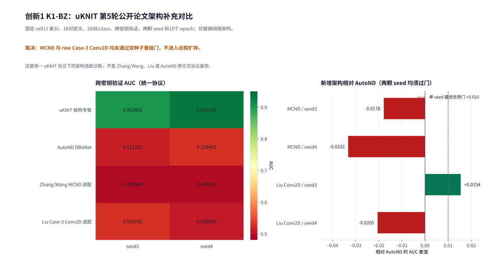
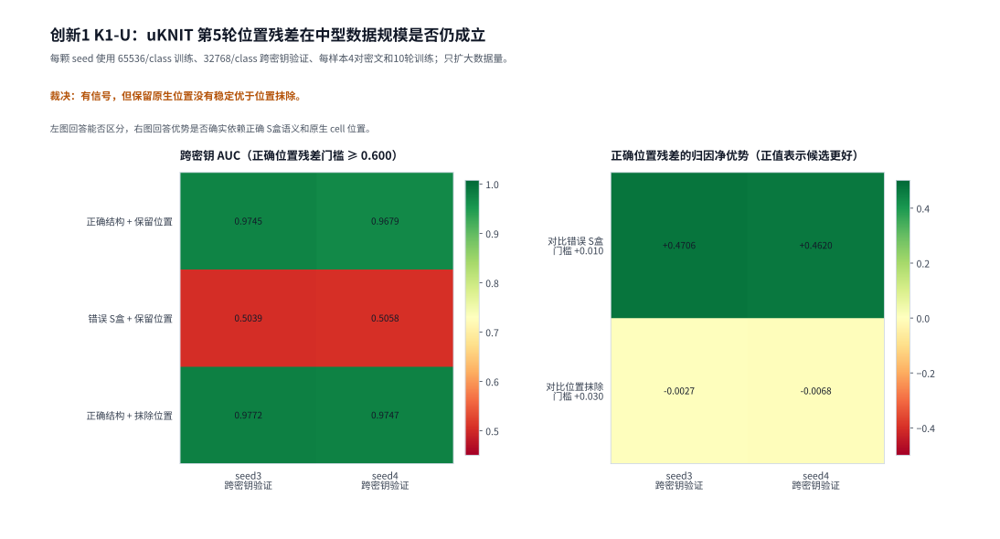
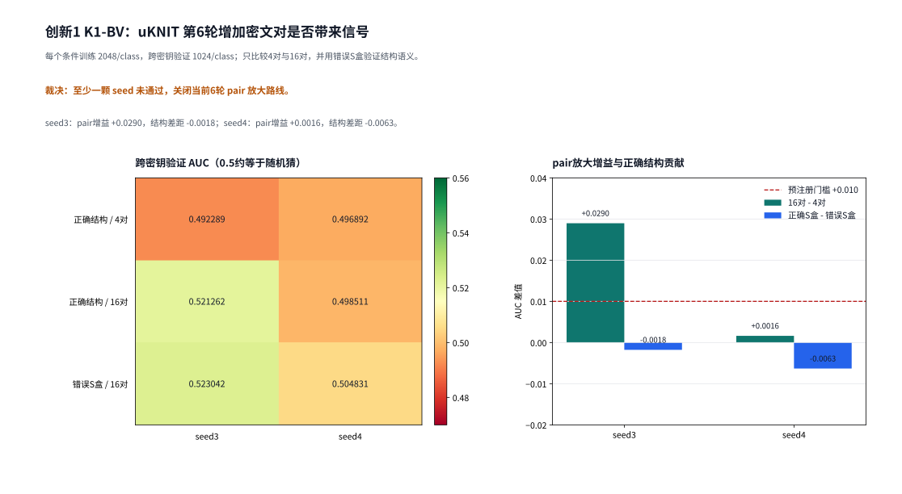
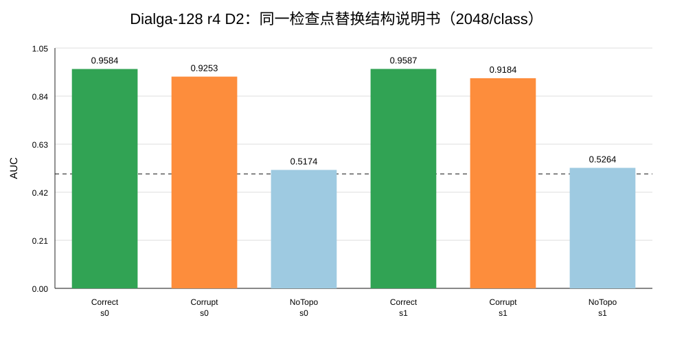
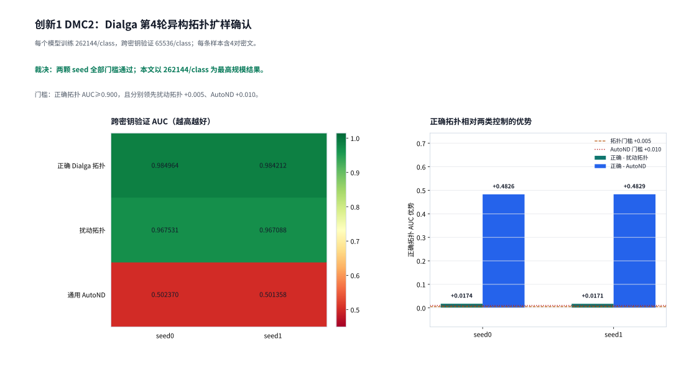

# 面向异构 SPN 的运行时结构先验神经区分方法：Dialga 拓扑归因与 uKNIT 非线性语义验证

> 稿件状态说明：本文为中文核心期刊投稿风格初稿，实验数据截至 2026 年 8 月 3 日。正文区分本地完整闭环、原始回收并重裁决以及远程 gate 完成但归档待闭环三类有效证据状态。本文把 `262144/class` 和两个随机种子设为主实验的最高证据规模，只纳入完成必要对照的实验矩阵。投稿定稿时仍需逐条核验参考文献和作者信息，并按目标期刊体例调整篇幅。

## 摘要

针对异构代换—置换网络（substitution-permutation network，SPN）中非连续状态单元、逐阶段非线性语义及多线性层拓扑难以被通用神经区分器显式利用的问题，提出一种运行时结构先验神经区分方法。该方法将公开密码结构编码为可执行说明书，包括原生单元映射、单元内比特角色、S 盒真值语义、逐轮 GF(2) 连接关系和观察窗口；在统一消费接口下，分别构造 uKNIT-BC 非线性语义专家和 Dialga-128 Runtime-E4 拓扑专家。uKNIT-BC 5 轮 K1-U 在每类 65536 个训练样本、两个随机种子下取得 0.974540/0.967867 的正确 S 盒 AUC，较错误 S 盒控制提高 0.470640/0.462040；位置不变控制进一步达到 0.977201/0.974682，表明核心增益来自正确非线性语义，并支持采用更简洁的位置不变表示。Dialga-128 4 轮 D2 在同一冻结检查点下仅替换说明书，正确拓扑 AUC 为 0.958417/0.958679，无拓扑时降至 0.517403/0.526351。最高规模 DMC2 在每类 262144 个训练样本下取得 0.984964/0.984212 的正确拓扑 AUC，较扰动拓扑提高 0.017434/0.017124，而同预算 AutoND/DBitNet 为 0.502370/0.501358。两个案例共同表明，机器可读结构说明书能够把公开的非线性语义和线性拓扑转化为稳定、可归因的神经区分优势，为异构 SPN 的结构驱动建模提供了可复核的方法路径。

**关键词：** 神经区分器；代换—置换网络；结构先验；uKNIT-BC；Dialga-128；跨密钥评估

## 1 引言

神经区分器将约化轮密码分析转化为统计学习问题：模型根据一个或多个密文对，判断样本来自给定输入差分下的真实加密分布，还是来自协议规定的负样本分布。自神经差分密码分析在 ARX 密码上显示出有效性以来，卷积网络、残差网络和自动化网络搜索逐渐被用于多种公开分组密码的离线安全评估[1-4]。现有方法常把密文比特直接排列为向量或规则张量，再由网络自行发现有效统计关系。该范式便于迁移，但也弱化了一个基本事实：分组密码的 S 盒、状态单元划分和线性扩散拓扑均为公开且具有明确语义的结构信息。

对结构规则、轮函数对齐的传统 SPN，固定卷积感受野或按 nibble 分组的输入表示有时能够隐式吸收部分结构。异构 SPN 则提出了更严格的要求。例如，状态中的逻辑 cell 可能由非连续比特组成，不同阶段可能使用不同 S 盒，线性层也可能随轮次变化。若仅依赖密码名称绑定一个固定网络，模型无法清楚表达“某一比特在当前轮中属于哪个 cell、承担什么角色、由哪些源比特经 GF(2) 关系生成”。若模型在正确结构和错误结构下均取得相近结果，则性能也不能归因于密码结构本身。

本文选择 uKNIT-BC 与 Dialga-128 作为两个互补案例。uKNIT 的非轮对齐设计使阶段身份、原生 cell 位置和非线性语义成为主要建模对象；Dialga 使用多个线性层，其非连续 cell 与 GF(2) 源—目标连接更适合检验拓扑信息。本文并不假设二者共享同一种充分统计量，而是统一结构说明书、运行时消费接口和控制实验原则，再针对不同结构机制配置差异化专家。

围绕上述目标，本文研究三个问题：

1. 在数据、优化器、训练轮数和负样本定义保持一致的条件下，结构专家能否优于通用 AutoND/DBitNet 及其他公开网络架构适配器？
2. 观察到的优势是否依赖正确的 S 盒或 GF(2) 拓扑，而不是参数量、训练随机性或简单的多密文对聚合？
3. 结构信号在增加一轮后能否保持，其可重复边界在哪里？

本文的主要工作如下。

（1）构建面向异构 SPN 的运行时结构说明书，把 `cell_membership`、`bit_role`、S 盒真值表、逐轮线性源关系和观察窗口从固定模型代码中分离，作为可校验的结构输入。

（2）针对两类结构机制设计差异化专家。uKNIT 专家由两轮算子组合窗口生成五阶段视图，在原生 cell 上统计 4 bit 取值分布；Dialga Runtime-E4 专家按运行时说明书重组非连续 cell，并沿多轮 GF(2) 拓扑融合密文对信息。

（3）形成正确结构、错误结构、无结构、通用模型、公开论文架构适配器及同检查点反事实替换的控制链。uKNIT 的正确 S 盒优势在两个 seed 上分别达到 0.470640 和 0.462040 AUC，Dialga 的正确拓扑优势在 `262144/class` 下稳定保持，并由同检查点替换进一步确认模型对运行时说明书的功能依赖。

## 2 相关工作

### 2.1 神经差分区分器

Gohr 将深度残差网络用于 SPECK 的约化轮差分区分，推动了神经网络与传统差分分析的结合[1]。后续研究从可解释性、数据复杂度、训练稳定性和泛化等角度重新评估神经区分器，指出高精度结果必须与输入差分、负样本构造、密钥抽样和测试协议共同解释[2-3]。因此，仅比较来自不同数据协议的单个 accuracy 或 AUC 并不足以支持方法优越性。本文采用同协议控制，并把 train、validation、seed、pairs/sample 和 samples/class 分开记录。

### 2.2 通用模型与自动化建模

AutoND/DBitNet 一类方法试图通过统一输入编码和自动化网络构造降低手工设计成本[4]。本文将其作为不显式消费目标密码运行时结构的通用基线，并让结构专家与 AutoND/DBitNet 使用相同数据、训练轮数和优化预算。该设置把模型间差值直接对应到当前协议下的结构归纳偏置，同时避免由不同数据规模造成的比较偏差。

### 2.3 SPN 专用架构、表示与多密文对聚合

SPN 神经区分研究主要从输入组织和网络几何两方面引入结构。Zhang 和 Wang 面向 DES、Chaskey 与 PRESENT 构造多密文对网络，以核宽为 1、2、4 的多分支一维卷积提取不同尺度特征，再通过递增奇数核残差块和全局平均池化完成预测[6]。Liu 等面向 SKINNY 与 MIDORI 将状态写成三通道二维矩阵，并采用二维卷积残差网络；其 Case-3 表示还包含逆轮处理后的状态与差分[7]。这些工作说明，多尺度卷积、状态矩阵和逆轮表示均是重要的公开先例，但其密码、差分、负样本、训练规模和评价指标与本文 uKNIT 协议并不一致。

为避免只与 AutoND/DBitNet 比较，本文把上述两类骨干迁移到冻结的 uKNIT K1-BS 协议：MCND 适配器保留多分支一维卷积、递增核残差块与全局平均池化；Case-3 Conv2D 适配器使用 \(C\)、\(C'\) 和原始 \(C\oplus C'\) 三通道状态矩阵。后者有意不使用 Liu 等的逆轮表示，以单独考察 Conv2D 骨干，而不把架构收益与特征工程混为一谈。因此，这两行是统一协议下的架构适配，不是原论文复现。

多密文对输入可以通过均值、注意力或集合网络降低单对预测方差，但 pair 数增加本身不保证产生新的可归因信号[8]。如果正确结构与错误结构随 pair 数同步改善，则不能把增益解释为语义先验。本文在 uKNIT K1-BV 中同时设置 exact 4-pair、exact 16-pair 和 wrong-S-box 16-pair，以区分数量放大与结构语义。

### 2.4 uKNIT 与 Dialga 的公开设计

uKNIT 通过打破传统轮对齐组织轻量级密码结构，其公开设计强调不同非线性原语与线性变换的组合[9]。Dialga 是使用多个线性层的低时延可调分组密码族，具有适合硬件时延约束的结构安排[10]。本文仅在二者公开算法的约化轮版本上进行离线区分实验，目标是研究神经模型对结构说明书的消费能力，而不是重新评价其完整轮安全性。

## 3 问题定义与证据分级

### 3.1 区分任务

设公开分组密码的约化轮映射为 \(E_r(\cdot,K)\)，输入差分为 \(\Delta P\)。每个样本包含 \(q\) 个密文对。正样本中，

\[
P_i'=P_i\oplus \Delta P,\qquad
(C_i,C_i')=(E_r(P_i,K),E_r(P_i',K)),
\]

其中 \(i=1,\ldots,q\)。严格负样本同样经过公开加密算法生成，但使用独立随机明文构造，使标签差异不退化为“密文是否经过加密”的简单判别。uKNIT 协议使用 encrypted random plaintexts，Dialga 协议使用 encrypted random plaintext pairs。二分类标签只表示正、负样本来源，不表示密钥比特或明文属性。

模型输出分数 \(s(x)\)，主要指标为受试者工作特征曲线下面积（AUC）；accuracy 依赖阈值，仅作为补充。结构归因主要比较

\[
\Delta_{\mathrm{sem}}=\mathrm{AUC}_{\mathrm{correct}}-\mathrm{AUC}_{\mathrm{wrong}},
\]

以及正确结构相对无结构或通用基线的差值。本文对不同 seed 分别报告结果，不以两点均值掩盖方向不一致。

### 3.2 证据状态

为防止远程训练完成被误写为论文证据闭环，本文使用表 1 的证据状态。这里的“gate”指依据预先记录的阈值、必要控制和计划一致性作出的研究裁决，不等同于训练脚本正常退出。

**表 1  实验结果的证据状态**

| 状态 | 判定条件 | 本文实验 |
|---|---|---|
| 本地完整闭环 | 本地具有规范结果、验证、gate 及可追溯产物 | uKNIT K1-BS、K1-BZ；Dialga D1、D2、D3 |
| 原始回收并重裁决 | 从远程运行根回收原始归档，校验清单、验证和本地 gate 可追溯，但不是完整的验证结果分支归档 | uKNIT K1-U、Dialga DMC2 |
| 远程 gate 已完成，归档待闭环 | 远程验证和研究 gate 已完成，但最终归档或本地规范重裁决不完整 | uKNIT K1-BV、Dialga DMC1 |

该分级保证正文中的每项性能比较均具备完整结果矩阵和可追溯协议。本地闭环结果用于机制与边界判断；原始回收结果在完成清单校验和本地重裁决后用于主结果，同时在材料说明中保留归档来源。

## 4 运行时结构先验方法

### 4.1 结构说明书与统一接口

运行时结构说明书是机器可读、可校验的公开结构描述，而非密码名称或自然语言标签。设状态宽度为 \(n\)，4 bit cell 数为 \(m=n/4\)。说明书至少包含：

\[
\mathcal S=\{n,\pi_{\mathrm{cell}},\pi_{\mathrm{role}},T_S^{(t)},A^{(t)},W\},
\]

其中，\(\pi_{\mathrm{cell}}:\{0,\ldots,n-1\}\rightarrow\{0,\ldots,m-1\}\) 表示比特所属原生 cell，\(\pi_{\mathrm{role}}\) 表示比特在 cell 中的 0—3 号角色，\(T_S^{(t)}\) 为第 \(t\) 个阶段或轮次的 S 盒真值语义，\(A^{(t)}\) 为 GF(2) 上目标比特与源比特的连接关系，\(W\) 为模型消费的结构窗口。

统一接口完成三项工作：校验状态宽度与 cell 完整性；把任意物理比特位置重组为有序原生 cell；向结构专家提供逐轮算子而不在网络中硬编码密码名称。本文所谓“统一”限于该说明书和消费协议。uKNIT 与 Dialga 的特征提取器及已训练权重并不共享。

### 4.2 uKNIT 五阶段原生单元位置直方图专家

uKNIT 专家消费两轮运行时结构窗口。对每个密文对，程序按公开算子精确组合生成 `COMPOSITION_STAGE_NAMES` 对应的五个阶段视图。每个阶段中的比特依据 \(\pi_{\mathrm{cell}}\) 和 \(\pi_{\mathrm{role}}\) 重组为有序 4 bit 原生单元，得到取值 \(v_{t,c,i}\in\{0,\ldots,15\}\)。对一个样本的 \(q\) 个密文对，计算

\[
h_{t,c,a}=\frac{1}{q}\sum_{i=1}^{q}\mathbf 1[v_{t,c,i}=a],
\quad a\in\{0,\ldots,15\}.
\]

由此形成“阶段 × 原生 cell × 16 类取值”的 pair-mean one-hot 直方图。16 维取值分布先经共享编码器映射，再保留阶段和位置身份进行投影；所得结构残差通过有界门控与基础密文对表示融合。该表示不是简单的“逆 S 盒若干次”，而是精确算子组合视图在原生位置上的统计读出。

wrong-S-box 控制只替换 S 盒真值语义，线性矩阵、cell 布局、样本、pair 数和训练预算保持不变。若正确 S 盒未稳定优于错误 S 盒，则不能把结果归因于正确非线性语义。

### 4.3 Dialga Runtime-E4 拓扑专家

Dialga 说明书给出非连续 `cell_membership`、cell 内 `bit_role`、S 盒真值及多轮 GF(2) `target_sources`。Runtime-E4 首先从每个密文对构造左状态、右状态及其异或差分，并按说明书把物理位置重组为 cell token；随后利用真实源—目标连接形成图上下文或精确逆线性上下文，在若干结构处理步中融合 cell、拓扑和 S 盒信息。pair 内部和多个 pair 之间分别通过等变混合、均值/最大值与注意力聚合，最后输出区分分数。

正确拓扑控制使用公开说明书；扰动拓扑在保持张量尺寸和训练流程的条件下确定性改变连接关系；无拓扑控制关闭真实关系；AutoND/DBitNet 不消费该运行时拓扑。D2 是最强的机制控制：固定 D1 正确拓扑模型的同一检查点，不再训练，仅在推理时换入正确、扰动或无拓扑说明书。这样可以排除不同初始化和不同优化轨迹，把预测变化直接关联到运行时说明书。

### 4.4 方法边界

本方法不是“一个网络通吃所有 SPN”。其框架可表示多类公开结构，但结构专家仍依赖问题机制：uKNIT 侧重阶段—位置—取值分布，Dialga 侧重非连续 cell 和 GF(2) 拓扑。若目标密码需要新的结构算子，仍需新增与必要控制一同验证的专家。结构说明书也不自动产生可区分性；当输入差分在更高轮数扩散后不再保留可学习统计，正确结构模型仍可能接近随机。

## 5 实验设置

### 5.1 公共设置

全部实验均针对公开算法的离线约化轮区分。优化器为 Adam，损失函数为均方误差，训练 10 个 epoch；每项比较冻结设备、数据协议、负样本定义与优化预算，不在同预算比较中途切换设备。表中 `samples/class` 表示每类样本数，总训练行数为其两倍。K1-BS/K1-BZ 的 2048/class 用于公开架构筛选，K1-U 和 DMC1 的 65536/class 用于机制确认，DMC2 的 262144/class 构成本文最高规模的双 seed 主结果。实验规模由本文的结构归因问题和必要控制共同确定。除报告 accuracy 外，裁决优先使用不依赖固定阈值的 AUC。

### 5.2 uKNIT 协议

K1-BS 使用 uKNIT-BC r5、16 pairs/sample、2048/class 训练和 1024/class 跨密钥验证，seed 为 3、4；比较结构专家、AutoND/DBitNet 与两个项目内部通用 SPN 网络。K1-BZ 逐项复用 K1-BS 的差分、密钥、数据缓存、负样本、优化器和验证集，只新增 Zhang/Wang MCND 与 Liu raw Case-3 Conv2D 两个适配器。MCND 适配器含 650177 个参数；Conv2D 适配器含 130945 个参数。由于本机 CUDA 不可用，该极小诊断按预注册例外在 CPU 上执行，未把中等规模训练转移到本地 CPU。

K1-BZ 的晋级门要求同一适配器在两个 seed 上均满足 AUC 不低于 0.550，且相对对应 AutoND/DBitNet 至少提高 0.010。该筛选用于从公开架构中选择值得扩大预算的强基线；未通过筛选的适配器不再机械扩样。

K1-U 使用 uKNIT-BC r5、4 pairs/sample、65536/class 训练和 32768/class 跨密钥验证，seed 为 3、4。它比较正确 S 盒加原生位置、错误 S 盒加原生位置和正确 S 盒加位置不变聚合，分别检验非线性语义与精确位置身份。K1-BV 使用 uKNIT-BC r6，训练 2048/class，跨密钥验证 1024/class，seed 为 3、4；比较 exact 4-pair、exact 16-pair 与 wrong-S-box 16-pair。K1-BV 是远程小规模边界诊断，不用于估计 r6 的方法上限。

### 5.3 Dialga 协议

D1 使用 Dialga-128 prefix-r4，4 pairs/sample，训练 2048/class，验证 1024/class，seed 为 0、1，分别训练正确拓扑、扰动拓扑和无拓扑模型。D2 复用 D1 正确拓扑检查点及相同验证协议，只替换推理说明书。DMC1 和 DMC2 保持 prefix-r4、4 pairs/sample、两个 seed 及三模型矩阵，训练规模分别为 65536/class 和 262144/class；DMC2 的验证规模为 65536/class。Runtime-E4 有 442466 个参数，AutoND/DBitNet 有 797633 个参数；两者数据和优化预算一致，但并非参数量匹配。D3 使用 prefix-r5、2048/class、4 pairs/sample、seed 0/1，检查相邻轮数窗口能否复制 r4 结果。

**表 2  实验矩阵与当前证据状态**

| 实验 | 算法/轮数 | pairs | 训练 samples/class | 验证 samples/class | seeds | 主要控制 | 状态 |
|---|---|---:|---:|---:|---|---|---|
| K1-BS | uKNIT-BC r5 | 16 | 2048 | 1024 | 3、4 | AutoND、两个内部通用 SPN 网络 | 本地完整闭环，gate=`pass` |
| K1-BZ | uKNIT-BC r5 | 16 | 2048 | 1024 | 3、4 | MCND、raw Case-3 Conv2D | 本地完整闭环，gate=`hold` |
| K1-U | uKNIT-BC r5 | 4 | 65536 | 32768 | 3、4 | wrong-S-box、位置不变 | 原始回收，语义门通过；位置门选择位置不变表示 |
| K1-BV | uKNIT-BC r6 | 4/16 | 2048 | 1024 | 3、4 | wrong-S-box | 远程 gate=`hold`，归档待闭环 |
| D1 | Dialga-128 prefix-r4 | 4 | 2048 | 1024 | 0、1 | 扰动/无拓扑 | 本地完整闭环，gate=`pass` |
| D2 | Dialga-128 prefix-r4 | 4 | 不再训练 | 复用 D1 协议 | 0、1 | 同检查点替换说明书 | 本地完整闭环 |
| DMC1 | Dialga-128 prefix-r4 | 4 | 65536 | 16384 | 0、1 | 扰动拓扑、AutoND | 远程 gate=`pass`，归档待闭环 |
| DMC2 | Dialga-128 prefix-r4 | 4 | 262144 | 65536 | 0、1 | 扰动拓扑、AutoND | 原始回收并本地重裁决，gate=`pass` |
| D3 | Dialga-128 prefix-r5 | 4 | 2048 | 1024 | 0、1 | 扰动/无拓扑 | 本地完整闭环，gate=`hold` |

## 6 实验结果与分析

### 6.1 uKNIT K1-BS/K1-BZ：公开架构补充对比

表 3 汇总冻结的 K1-BS 锚点与 K1-BZ 新增架构。结构专家在 seed 3/4 的 AUC 为 0.902802/0.932539；AutoND/DBitNet 为 0.511321/0.526423。新增的 Zhang/Wang MCND 适配器为 0.493508/0.493233，Liu raw Case-3 Conv2D 适配器为 0.526742/0.505930。图 1 左侧给出统一协议下的四模型 AUC，右侧给出新增适配器相对 AutoND/DBitNet 的逐 seed 差值。

**表 3  uKNIT-BC r5 统一小样本协议下的公开架构补充对比**

| 模型 | 参数量 | seed 3 AUC | seed 4 AUC | 相对 AutoND（seed 3/4） |
|---|---:|---:|---:|---:|
| 五阶段位置直方图结构专家（K1-BS） | 214316 | 0.902801514 | 0.932538986 | +0.391480446/+0.406115532 |
| AutoND/DBitNet（K1-BS） | 985985 | 0.511321068 | 0.526423454 | 0/0 |
| Zhang/Wang MCND 适配（K1-BZ） | 650177 | 0.493507862 | 0.493232727 | −0.017813206/−0.033190727 |
| Liu raw Case-3 Conv2D 适配（K1-BZ） | 130945 | 0.526742458 | 0.505930424 | +0.015421390/−0.020493030 |

**图 1  uKNIT K1-BZ 公开论文架构补充对比。固定 r5、cell11 差分、16 pairs/sample、2048/class、跨密钥验证、seed 3/4 和 10 个 epoch；图中结果是架构适配诊断，不是三篇基线论文的原协议复现。**

MCND 在两个 seed 上均低于 AutoND。Liu Conv2D 在 seed 3 高 0.015421，但 seed 4 低 0.020493，且两颗 seed 的 AUC 都未达到 0.550。预注册门要求同一适配器在两颗 seed 上同时达到 AUC 0.550，并相对 AutoND 至少提高 0.010，因此 gate 状态为 `hold`，决策为 `innovation1_uknit_k1bz_no_published_adapter_local_promotion`，不进入远程扩样。

在冻结的同协议筛选中，五阶段位置直方图结构专家相对 AutoND/DBitNet 提高 0.391480/0.406116 AUC，并在两个 seed 上同时保持优势。MCND 与 Liu Conv2D 作为公开架构适配器扩展了基线覆盖，其中 AutoND/DBitNet 仍是三种外部基线中的最强筛选对象，因此后续规模比较优先保留该基线。表 3 比较的是统一 uKNIT 可观测量下的架构适配效果，原论文完整协议的差异集中列入第 8 节。

### 6.2 uKNIT K1-U：正确 S 盒形成稳定优势，位置不变表示进一步简化模型

K1-U 把 uKNIT r5 结构语义验证扩展到 65536/class。表 4 显示，正确 S 盒加原生位置在两个 seed 上的 AUC 为 0.974540/0.967867，错误 S 盒控制为 0.503901/0.505827，语义差值达到 +0.470640/+0.462040。该方向在两个 seed 上一致，支持模型信号依赖正确 S 盒语义，而不是只依赖相同形状的结构输入。

**表 4  uKNIT-BC r5 K1-U 中等规模语义与位置控制**

| 条件 | seed 3 AUC | seed 4 AUC |
|---|---:|---:|
| 正确 S 盒 + 原生位置 | 0.974540495 | 0.967867357 |
| 错误 S 盒 + 原生位置 | 0.503900695 | 0.505827348 |
| 正确 S 盒 + 位置不变 | 0.977200513 | 0.974682369 |
| 正确位置分支 − 错误 S 盒 | +0.470639800 | +0.462040009 |
| 正确位置分支 − 位置不变 | −0.002660018 | −0.006815012 |

**图 2  uKNIT K1-U 的跨密钥 AUC 与归因差值。正确 S 盒相对错误 S 盒的优势在两个 seed 上稳定，而原生位置分支没有优于位置不变控制。**

位置不变控制在两个 seed 上又分别提高 0.002660 和 0.006815 AUC。这一结果把方法结论进一步收紧为更有用的设计选择：uKNIT 的主要增益来自正确 S 盒语义，而不是对固定原生位置的记忆，因此后续模型可以采用更简洁的位置不变单元统计。K1-U 的六行结果、四次数据缓存创建、八次跨模型复用、检查点重算和协议校验均通过；原始回收来源记录在附录 A 中。

### 6.3 uKNIT K1-BV：6 轮密文对放大未获支持

K1-BV 的主要裁决依据是 AUC，而非阈值相关的 accuracy。由表 5 可见，seed 3 从 exact 4-pair 增至 exact 16-pair 的 AUC 增量为 0.028973，但 wrong-S-box 16-pair 反而比 exact 16-pair 高 0.001780；seed 4 的 pair 增量仅为 0.001619，exact 16-pair 比 wrong-S-box 低 0.006320。两个 seed 均未形成“增加 pair 后正确语义稳定优于错误语义”的必要组合。

**表 5  uKNIT-BC r6 K1-BV 的 AUC 与 gate 派生量**

| 条件 | seed 3 AUC | seed 4 AUC |
|---|---:|---:|
| exact 4-pair | 0.492288589 | 0.496891975 |
| exact 16-pair | 0.521261692 | 0.498510838 |
| wrong-S-box 16-pair | 0.523041725 | 0.504830837 |
| pair gain：exact16 − exact4 | +0.028973103 | +0.001618862 |
| semantic gap：exact16 − wrong16 | −0.001780033 | −0.006320000 |

作为补充，三种条件的 accuracy 分别为：seed 3 下 0.498535、0.508789、0.500000；seed 4 下 0.500977、0.500977、0.501953。图 3 直接展示 AUC、pair 增益和正确 S 盒相对错误 S 盒的差值，与表 5 的 gate 量一致。

**图 3  uKNIT K1-BV 的 AUC、pair 增益与 S 盒语义差值。两个 seed 均未形成“增加 pair 且正确 S 盒稳定占优”的组合。**

远程 gate 状态为 `hold`，决策为 `innovation1_uknit_k1bv_pair_amplification_not_supported`，等级为 `unsupported`；最终结果打包失败。因此准确结论是：在该固定差分、固定结构专家和 2048/class 诊断预算下，没有证据支持通过 4-pair 到 16-pair 的机械放大获得 r6 结构优势。该结果不能外推为 uKNIT r6 不存在神经区分信号，更不能视为方法在所有更大规模上的上限。

### 6.4 Dialga D1：4 轮拓扑控制

D1 已完成本地结果、验证和 gate 闭环。表 6 中，正确拓扑在两个 seed 上均约为 0.9585，分别高于扰动拓扑 0.022107 和 0.020863；无拓扑结果接近随机，正确拓扑优势超过 0.455。扰动拓扑仍保留较高 AUC，说明 D1 信号并非全部来自精确接线，基础输入统计与部分结构可能已经提供区分信息；但正确拓扑在两个 seed 上方向一致的增量表明精确连接仍有贡献。

**表 6  Dialga-128 prefix-r4 D1 本地闭环结果**

| seed | 正确拓扑 AUC | 扰动拓扑 AUC | 无拓扑 AUC | 正确−扰动 | 正确−无拓扑 |
|---:|---:|---:|---:|---:|---:|
| 0 | 0.958416939 | 0.936309814 | 0.497210026 | +0.022107124 | +0.461206913 |
| 1 | 0.958679199 | 0.937816620 | 0.503405571 | +0.020862579 | +0.455273628 |

### 6.5 Dialga D2：同一冻结检查点的反事实说明书替换

D2 不重新训练模型，只在 D1 正确拓扑检查点上更换推理时结构说明书。表 7 显示，正确说明书的 AUC 保持为 0.958417/0.958679，扰动说明书下降至 0.925256/0.918380，无拓扑下降至 0.517403/0.526351。相对于扰动拓扑，正确拓扑优势为 0.033161 和 0.040299；相对于无拓扑，优势为 0.441014 和 0.432328。

**表 7  Dialga D2 同检查点结构替换结果**

| seed | 正确拓扑 AUC | 扰动拓扑 AUC | 无拓扑 AUC | 正确−扰动 | 正确−无拓扑 |
|---:|---:|---:|---:|---:|---:|
| 0 | 0.958416939 | 0.925255775 | 0.517402649 | +0.033161163 | +0.441014290 |
| 1 | 0.958679199 | 0.918379784 | 0.526350975 | +0.040299416 | +0.432328224 |

**图 4  Dialga D2 同一检查点下的结构说明书替换结果**

更换说明书还引起明显的逐样本预测变化：seed 0 的最大预测概率变化在扰动和无拓扑条件下分别为 0.912204、0.918676，seed 1 分别为 0.902221、0.869230。D2 因此提供了比“分别训练三个模型”更直接的功能依赖证据：在权重和检查点不变时，模型输出随运行时拓扑发生大幅变化，确认 Runtime-E4 在推理阶段实际消费了结构说明书。

### 6.6 Dialga DMC1/DMC2：4 轮拓扑效应的规模确认

DMC1 将训练规模提高到 65536/class，DMC2 进一步提高到 262144/class。两级实验均保持正确拓扑、扰动拓扑和 AutoND/DBitNet 三模型矩阵。表 8 显示，DMC2 正确拓扑 AUC 为 0.984964/0.984212，扰动拓扑为 0.967531/0.967088，正确拓扑增量为 +0.017434/+0.017124；AutoND/DBitNet 为 0.502370/0.501358。与 DMC1 相比，正确拓扑 AUC 提高，但关键归因不是绝对 AUC，而是两个 seed 上均保持正向的正确—扰动拓扑差值。

**表 8  Dialga-128 prefix-r4 DMC1/DMC2 规模梯度结果（AUC）**

| 规模与条件 | seed 0 | seed 1 |
|---|---:|---:|
| DMC1 正确运行时拓扑 | 0.978120916 | 0.978711151 |
| DMC1 扰动拓扑 | 0.964931685 | 0.964382136 |
| DMC1 AutoND/DBitNet | 0.507460726 | 0.500493946 |
| DMC1 正确−扰动 | +0.013189230 | +0.014329014 |
| DMC2 正确运行时拓扑 | 0.984964147 | 0.984212034 |
| DMC2 扰动拓扑 | 0.967530599 | 0.967087931 |
| DMC2 AutoND/DBitNet | 0.502369641 | 0.501357568 |
| DMC2 正确−扰动 | +0.017433548 | +0.017124103 |

**图 5  Dialga DMC2 两个随机种子下的 AUC 与正确—扰动拓扑差值。训练规模为 262144/class；该图已经过渲染像素检查。**

DMC2 的六行结果、四次缓存创建、八次参数匹配复用和六个检查点均通过本地重裁决，研究 gate 为 `pass`。在完全共享的数据与优化预算下，正确拓扑在两个 seed 上均优于扰动拓扑，并较 AutoND/DBitNet 提高 0.482595/0.482854 AUC。D1、D2、DMC1 和 DMC2 由此形成“独立训练对照、同检查点反事实、规模确认”三层拓扑证据链。归档来源、参数量差异和独立测试设置集中列入第 8 节。

### 6.7 Dialga D3：相邻 5 轮窗口未复制

D3 已在本地完成 gate，状态为 `hold`，决策为 `innovation1_dialga_runtime_e4_d3_adjacent_window_not_replicated`。表 9 中，正确拓扑在 seed 0 上略高于扰动拓扑 0.002948，却低于无拓扑 0.036830；seed 1 上同时低于扰动和无拓扑。方向不一致且整体接近随机，不能支持 prefix-r5 的拓扑效应。

**表 9  Dialga-128 prefix-r5 D3 本地边界结果**

| seed | 正确拓扑 AUC | 扰动拓扑 AUC | 无拓扑 AUC | 正确−扰动 | 正确−无拓扑 |
|---:|---:|---:|---:|---:|---:|
| 0 | 0.507329941 | 0.504382133 | 0.544159889 | +0.002947807 | −0.036829948 |
| 1 | 0.493329525 | 0.528279781 | 0.519388676 | −0.034950256 | −0.026059151 |

D3 只表明 D1/D2 的 prefix-r4 机制在当前 D3 配置下没有复制到相邻 prefix-r5 窗口。它不抹除 r4 的本地机制证据，也不能据此宣称 Dialga 神经区分的总体上限。

## 7 讨论

### 7.1 两个案例的共同主线

uKNIT 与 Dialga 提供了两条互补的结构证据链。前者检验“阶段 × 非线性取值分布”，后者检验“非连续 cell × GF(2) 源—目标拓扑”。正确 S 盒相对错误 S 盒的巨大差值表明非线性语义可以转化为稳定信号；同检查点拓扑替换和 DMC2 的双 seed 结果则表明线性连接关系既影响模型输出，也能在更大数据预算下保持优势。二者共同确立了机器可读说明书、差异化结构专家和反事实控制组成的方法主线。

### 7.2 结构基线与通用基线的不同作用

AutoND/DBitNet 衡量通用网络在同数据、同优化预算下的表现；MCND 与 Case-3 Conv2D 适配器扩展公开网络几何的覆盖；wrong-S-box、位置不变、扰动拓扑和无拓扑控制则定位结构专家的有效信息来源。三类基线共同回答“优势是否存在、是否来自正确结构、能否被更简单表示保留”。K1-BZ 确认结构专家在公开架构筛选中保持领先，K1-U 将增益定位到正确 S 盒语义并得到更简洁的位置不变表示，Dialga D2/DMC2 则把拓扑优势推进到同检查点功能归因和双 seed 规模确认。

### 7.3 成功窗口与失败边界应同时报告

K1-BS 在 r5 uKNIT 的小样本协议中显示可学习信号，K1-U 则在 65536/class 下确认正确 S 盒语义并收窄位置主张；D1/D2/DMC1/DMC2 在 prefix-r4 Dialga 中形成从本地机制到 262144/class 的拓扑证据链。K1-BZ 表明把另外两种公开网络骨干直接迁移到同一 raw-observable 协议并不能稳定复制信号。K1-BV 和 D3 进一步说明，增加 pair 或沿用相同网络并不能机械拓展一轮。失败边界有助于防止选择性报告，也提示下一步应优先审计差分传播、表示与观察窗口，而不是继续机械扩样。本文据此把实验上限停在 262144/class，并把论文定位为结构机制与反事实归因研究。

### 7.4 与传统密码分析结论的关系

本文结果属于离线、约化轮、固定协议的神经区分评估。AUC 高不直接给出密钥恢复复杂度，也不能与使用不同数据、查询模型和成功准则的传统攻击数字直接比较。特别是 Dialga 已有确定性线性分析背景，本文的意义是检验神经模型对异构拓扑的消费和归因，而不是声称超过确定性方法。多密文对聚合也属于应用层样本组织方式，不能把 16-pair 结果写成单密文对的原始区分能力。

## 8 局限性

本文仍存在以下限制。

第一，各实验的归档形态尚未完全统一。K1-BS、K1-BZ、D1、D2、D3 已在本地完成规范验证与 gate；K1-U 和 DMC2 从远程运行根回收后完成了清单校验、协议验证和本地重裁决；K1-BV 和 DMC1 仍需整理为统一归档格式。该差异不改变正文所列数值，但会增加材料复核成本。

第二，本文采用两个随机种子，最高训练规模为 262144/class。uKNIT 的语义差值达到 0.46 以上，Dialga 的拓扑差值在两个 seed 上方向一致，并有同检查点反事实作为独立支撑，因此该预算能够回答本文的结构归因问题。更多随机种子、独立最终测试和置信区间可用于进一步估计方差，但不作为当前方法结论的前置条件。

第三，比较并非完全容量匹配。K1-BS/K1-BZ 中结构专家、AutoND/DBitNet、MCND 和 Liu Conv2D 适配器的参数量分别为 214316、985985、650177 和 130945；Dialga Runtime-E4 与 AutoND/DBitNet 分别为 442466 和 797633。公开架构适配器也采用统一冻结超参数，而非逐篇复现其原始数据构造和搜索空间。本文通过同预算和结构反事实突出归纳偏置的作用，参数量匹配比较仍可作为后续补充。

第四，当前结论对应 uKNIT r5、Dialga prefix-r4 及其冻结差分协议。把说明书接口扩展到其他 SPN 仍需为目标结构配置相应专家和控制；训练时间、推理吞吐、显存占用及校准误差也有待在统一硬件条件下补充。

## 9 结论

本文提出一种面向异构 SPN 的运行时结构先验神经区分方法，把公开算法中的 cell、比特角色、S 盒语义和 GF(2) 拓扑编码为可执行说明书，再由与结构机制相匹配的专家消费。uKNIT K1-U 在 65536/class 下取得超过 0.96 的双 seed AUC，正确 S 盒相对错误语义提高 0.46 以上；位置不变控制进一步提升结果，给出了更简洁的非线性语义表示。Dialga D2 表明正确拓扑在同一冻结检查点下直接影响预测，DMC2 则在 262144/class、两个 seed 下保持正确拓扑相对扰动拓扑和 AutoND/DBitNet 的稳定优势。

两个案例共同说明，结构信息的价值不仅体现为更高 AUC，还能通过错误语义、扰动拓扑和同检查点替换被直接归因。由此形成的“统一结构说明书与控制协议、针对机制采用差异化专家”路线，在非轮对齐非线性结构和多线性层拓扑上均获得了可重复证据。后续工作将围绕更多结构类型、参数量匹配和统一运行效率评估展开。

## 数据与材料可得性声明（占位）

本文实验配置、模型实现、结果文件、验证记录和 gate 产物拟在论文录用或审稿政策允许的阶段公开。投稿前需根据匿名审稿要求替换为匿名仓库或补充材料链接。

## 伦理与利益冲突声明（占位）

本文仅研究公开分组密码的离线约化轮安全评估，不涉及真实网络系统、用户数据或未授权密钥材料。作者声明不存在需要披露的利益冲突（待全体作者确认）。

## 作者贡献与经费声明（占位）

作者贡献、基金项目名称及编号待作者团队确认后按目标期刊格式填写。

## 人工智能辅助写作声明（占位）

本文初稿使用生成式人工智能辅助整理结构、润色中文和核对实验表格；算法判断、实验设计、数据真实性、引用准确性及最终文本由作者负责。正式投稿时按目标期刊政策决定是否保留及如何表述本声明。

## 参考文献（占位，投稿前逐条核验）

[1] GOHR A. Improving attacks on round-reduced Speck32/64 using deep learning[C]//Advances in Cryptology—CRYPTO 2019. 2019.（卷号、页码待核验）

[2] BENAMIRA A, GERARD B, PEYRIN T, et al. A deeper look at machine learning-based cryptanalysis[C]. 2021.（正式题名、会议、页码待核验）

[3] GOHR A, LEANDER G, NEUMANN P. An assessment of differential-neural distinguishers[C]. 2022.（正式出版信息待核验）

[4] AutoND/DBitNet cipher-agnostic neural distinguisher pipeline[EB/OL]. 2023.（作者、正式题名、版本与公开代码地址待核验）

[5] 神经差分密码分析系统化综述（SoK）[C]. 2024.（作者、题名与出版信息待核验）

[6] ZHANG L, WANG Z. Improving Differential-Neural Distinguisher Model for DES, Chaskey and PRESENT[EB/OL]. arXiv:2204.06341, 2022.（正式出版版本与页码待核验）

[7] LIU J S, LI M M, REN J J, CHEN S Z. A Highly Efficient Neural Distinguisher Framework for IoT-Friendly Lightweight SPN Block Ciphers[J]. IEICE Transactions on Information and Systems, 2026. DOI: 10.1587/transinf.2025EDP7070.（卷期页码待核验）

[8] 多密文对神经区分与聚合方法相关工作[C/J].（作者、题名与出版信息待核验）

[9] HU K, KHAIRALLAH M, PEYRIN T, TAN Q Q. uKNIT: Breaking Round-Alignment for Cipher Design[J]. IACR Transactions on Symmetric Cryptology, 2026(2). DOI: 10.46586/tosc.a0zo-4njsuvm.（页码待核验）

[10] BANIK S, et al. Dialga: A Family of Low-Latency Tweakable Block Ciphers Using Multiple Linear Layers[J]. IACR Transactions on Symmetric Cryptology, 2025(4): 70-124. DOI: 10.46586/tosc.v2025.i4.70-124.（完整作者列表待核验）

[11] GPD 等通用密码区分模型相关工作[C/J]. 2025.（作者、题名与出版信息待核验）

## 附录 A 证据路径与复核边界

**表 A1  本文关键结果的本地证据入口**

| 实验 | 证据入口 | 当前边界 |
|---|---|---|
| uKNIT K1-BS | `docs/experiments/innovation1-uknit-r5-neural-architecture-ablation-k1bs-plan.md`；`outputs/local_diagnostic/i1_uknit_r5_neural_architecture_ablation_k1bs_16pair_2048_seed3_seed4_20260731/` | 本地完整闭环；小样本架构诊断 |
| uKNIT K1-BZ | `docs/experiments/innovation1-uknit-r5-published-architecture-baselines-k1bz-plan.md`；`outputs/local_diagnostic/i1_uknit_r5_published_architecture_baselines_k1bz_16pair_2048_seed3_seed4_20260802/` | 本地完整闭环，gate=`hold`；架构适配而非原论文复现 |
| uKNIT K1-U | `docs/experiments/innovation1-uknit-family-ctspn-position-residual-k1u-medium-plan.md`；`outputs/remote_results_incomplete/i1_uknit_family_ctspn_position_residual_k1u_medium_65536_seed3_seed4_20260728/` | 原始回收、校验与协议检查通过；正确 S 盒语义门通过，并选择更简洁的位置不变表示 |
| uKNIT K1-BV | `docs/experiments/innovation1-uknit-r6-pair-amplification-k1bv-plan.md`；`outputs/remote_results_incomplete/i1_uknit_r6_pair_amplification_k1bv_2048_seed3_seed4_20260731_monitor/` | 远程 gate=`hold`；待整理为统一归档 |
| Dialga D1 | `docs/experiments/innovation1-dialga128-runtime-e4-d1-r4-2048-plan.md`；`outputs/local_diagnostic/i1_dialga128_runtime_e4_d1_r4_2048_seed0_seed1_20260725/results.jsonl` | 本地完整闭环 |
| Dialga D2 | `docs/experiments/innovation1-dialga128-runtime-e4-d2-same-checkpoint-plan.md`；`outputs/local_audits/i1_dialga128_runtime_e4_d2_same_checkpoint_20260725/results.jsonl` | 本地完整闭环 |
| Dialga DMC1 | `docs/experiments/innovation1-dialga128-runtime-e4-dmc1-r4-medium-plan.md`；`outputs/remote_results_incomplete/i1_dialga128_runtime_e4_dmc1_r4_65536_seed0_seed1_20260731_monitor/` | 远程 gate=`pass`；待整理为统一归档 |
| Dialga DMC2 | `docs/experiments/innovation1-dialga128-runtime-e4-dmc2-r4-262144-plan.md`；`outputs/remote_results_incomplete/i1_dialga128_runtime_e4_dmc2_r4_262144_seed0_seed1_20260801/` | 原始回收并本地重裁决，gate=`pass`；本文最高规模结果，不含独立最终测试 |
| Dialga D3 | `docs/experiments/innovation1-dialga128-runtime-e4-d3-r5-2048-plan.md`；`outputs/local_diagnostic/i1_dialga128_runtime_e4_d3_r5_2048_seed0_seed1_20260725/results.jsonl` | 本地完整闭环，gate=`hold` |
